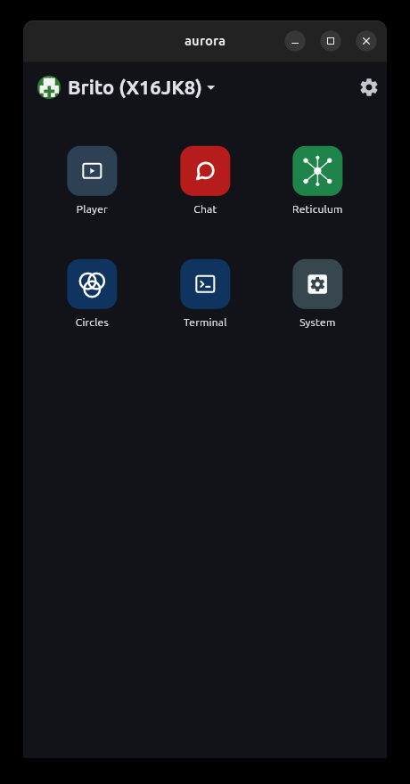
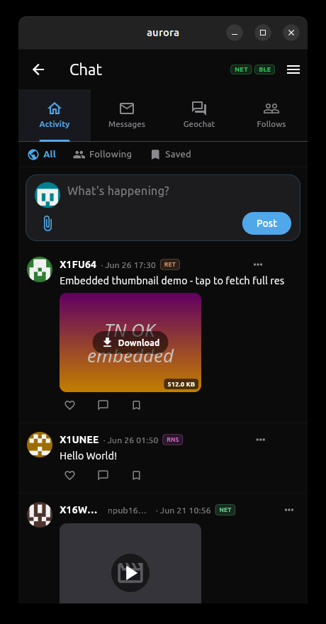
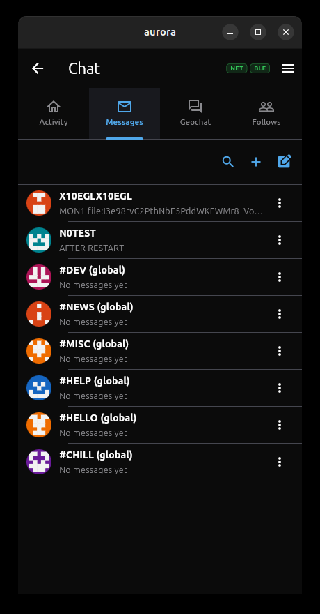
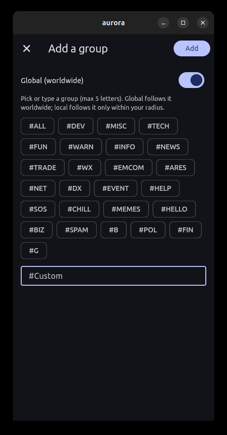
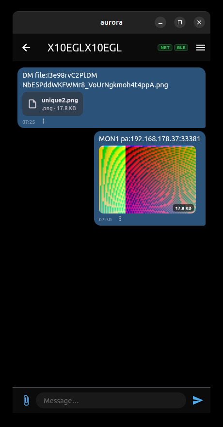
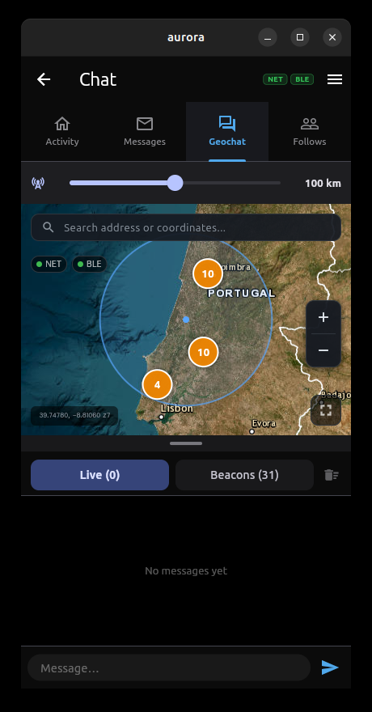

# Chat

A full messaging station for the [Aurora](https://github.com/geograms/aurora)
mesh. One panel covers everything: a Twitter-style **Activity** feed, **1:1 and
group messaging**, a live **Geochat** map of nearby stations, and a **Follows**
roster — all riding over three transports at once: **APRS** (radio / APRS-IS
internet), **Bluetooth LE**, and **Reticulum** (internet + LXMF).

The app speaks each transport transparently. You write a message; it goes out
over whatever path can reach the recipient, and every incoming message is
tagged with the path it arrived on (`NET` internet, `BLE` bluetooth, `RET`/`RNS`
Reticulum, `RLY` relay). No transport picking, no separate inboxes.

| | |
|---|---|
| **id** | `tools.geogram.chat` |
| **kind** | app |
| **transports** | APRS-IS, Bluetooth LE, Reticulum (LXMF) |
| **platforms** | Linux, Windows, macOS, Android |

---

## At a glance

<p align="center">
  
  
  
</p>

Launch Chat from the red tile (left). It opens on the **Activity** feed
(centre) and the **Messages** list (right) is one tap away.

---

## Features

### Activity — a public feed


A Twitter-like stream of the people you follow plus public broadcasts. Posts
carry text, embedded media thumbnails (tap to fetch full resolution), like /
reply / save actions, and a transport badge showing how each post reached you
(`RET`, `RNS`, `NET`, `BLE`). Filter between **All**, **Following** and
**Saved**, and compose your own post from the top composer.

- **Block / Mute** — the three-dot menu on any post blocks the author (their
  past and future posts disappear) or mutes them (only new posts are hidden).
- Old posts show the full date; recent ones show the time.

### Messages — 1:1 and groups


The conversation list mixes direct chats and group channels. Group titles are
prefixed with `#`; `(global)` groups are followed worldwide, local groups only
within your map radius. Every contact and group gets a deterministic
**identicon** so identities stay visually distinct without uploaded avatars.

Fresh installs come seeded with a set of global groups — `#DEV`, `#NEWS`,
`#MISC`, `#HELP`, `#HELLO`, `#CHILL` — so there's always something to read on
first run. The toolbar adds **search** (find a person across the local DB and
the Reticulum network), **+** (join/create a group), and **compose** (new 1:1).

#### Joining a group



Pick from the preset chips or type a custom tag (max 5 letters). The **Global
(worldwide)** toggle decides scope: global follows the tag everywhere; off, it
only follows stations inside your map radius.

#### Inside a chat



Bubble view with timestamps, per-message actions, file attachments and inline
images. Media is content-addressed (`file:<hash>` references) so the same image
is fetched once and shared across messages. Direct 1:1 messages are
**end-to-end encrypted** to the recipient's key when known, and can be
**signed** so peers can verify authorship.

### Geochat — live map



A live map of stations and geotagged messages around you. The range slider sets
your filter radius (here 100 km); pins cluster nearby beacons. Switch between
**Live** chat and the **Beacons** roster, search an address, and zoom. Position,
status, emergency and timed beacons are composed here and broadcast over APRS
and BLE.

### Follows


Manage who you follow and who follows you. Following a callsign streams their
public Activity (over APRS budlists and BLE when in range) into your feed.

---

## How it reaches people

Chat is built to deliver across whatever network is available:

- **APRS** — connects to APRS-IS over a raw TCP socket; the passcode is computed
  so it can transmit. Also rides amateur radio / digipeaters.
- **Bluetooth LE** — connectionless broadcast for short messages and beacons;
  GATT for larger transfers. A phone with internet automatically **bridges** its
  BLE peers onto the Reticulum hubs, so an offline BLE-only phone stays
  reachable from across the world.
- **Reticulum** — 1:1 LXMF messaging plus a backstop for APRS direct messages
  (with an optional internet-only private mode), and a NOSTR-style relay backup
  for store-and-forward delivery when the recipient is offline.

Encryption (ECDH + AES) and short-Schnorr signing happen host-side — the
private key never enters the wapp. Public keys are learned from periodic
callsign→key beacons.

---

## Building

From the `wapps/` repository root:

```sh
export WASI_SDK_PATH=$HOME/wasi-sdk   # see install-wasi-sdk.sh
./build-archive.sh chat               # compile + package chat into binaries/chat/
```

`build-archive.sh` with no argument builds every wapp. The resulting `.wapp`
bundle is loaded by the Aurora host engine — see the
[Aurora](https://github.com/geograms/aurora) repository for the host build and
run instructions.
